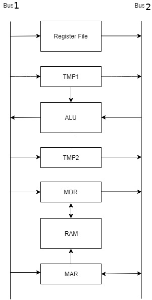

# shiny-processor
Processor with basic PDP11-like ISA implemented in VHDL. Computer Architecture Team Project.

# Overview
The processor follows a two-bus architecture:

Register and ALU operation are controlled by a control unit implemented as a finite state machine. The processor's ISA includes addition, subtraction, inversion, rotation, jumps, branches, etc. and it also supports hardware interrupts (one interrupt which simply cleans some register is included as an example). See the Phase 1 doc file in docs/ for a more in-depth view into which instructions are supported. An assembler (for Linux-based OS's) and some test cases are included in the assembler folder. To use the assembler run it giving the desired file as an argument (i.e. ./assembler testcases/c1.asm).
